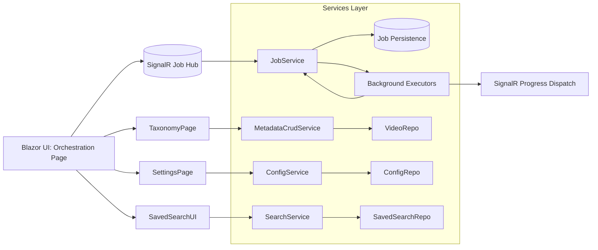

# Active Context

This file tracks the project's current status, including recent changes, current goals, and open questions.
2025-10-13 11:10:34 - Log of updates made.

*

## Current Focus

* Milestone M1 implementation readiness (plan finalized; awaiting code execution phase)

## Recent Changes

* Created productContext.md initial seed from productBrief.md
* Established session focus: feature gap analysis (2025-10-13 11:11 PT)
* Completed feature inventory, gap analysis, prioritization criteria definition
* Produced scored ranked backlog & selected M1 scope
* Defined detailed acceptance criteria per epic (E1–E5)
* Broke epics into actionable tasks with sequencing (Phases 1–5)
* Logged decision approvals: backup job stub included, job retention=200, taxonomy merge escalation deferred

## Open Questions/Issues

* None blocking implementation
* Track deferred items for next milestone backlog (External Search → Download Queue, Verification Dashboard, Backup UI, Scheduling Layer)
## Feature Inventory (2025-10-13 11:12 PT)

Implemented (confirmed in code review of Blazor pages & services):
- Dashboard: aggregate stats (counts, storage, charts: year, genre, format, quality distribution, recent videos, top artists, top collections, library stats)
- Video Library (/videos): facet filtering (genres, artists, years, formats), search suggestions, paging/infinite style load more, grid/list toggle, bulk selection & batch operations (play, edit metadata, add/remove collections, refresh metadata, organize files, export NFO, delete), smart collection creation from filters, keyboard shortcuts, SignalR live updates
- Collections (/collections): CRUD, filter by type, favorites/public toggles, play collection, export, delete, import playlist; types include Manual, Smart, Playlist, Series, Album
- Player (/player): playlist session handling (single video, collection, existing session), queue management (play next, queue add), keyboard shortcuts, next/previous playback
- Import (/import): library scan sessions with decision workflow (approve/reject/needs attention), duplicate detection indicators, manual match selection (candidate dropdown), commit/rollback, summary stats
- Advanced Search (/search): complex multi-filter query builder (artists, genres, year range, duration range, formats, resolutions, collections, metadata presence flags, added date range, sort & direction), pagination, saved searches load/save, external search integration (IMVDb + yt-dlp) with confidence, partial metadata preview and thumbnails
- Video Details (/videos/{id}): metadata display & inline edit form, play/queue operations, source verification (status chip, verification invoke, comparison metrics, override mark verified/mismatch), genre/tag chips
- Thumbnail Manager (/thumbnails): statistics & missing thumbnail generation (batch with progress + cancel, single generation)
- Setup Wizard (/setup): multi-step initial configuration (paths, download prefs, API keys, admin account, review)
- Services Layer: download queue, metadata enrichment (including confidence & manual review hook), library import processing, search facets & queries, playlist/session management, file organization, NFO export, thumbnail generation, source verification, backups (service present), metrics service scaffold, background job executors (metadata refresh, file organization, source verification), channel-based background infrastructure
- Smart Collections: criteria generation logic present in Videos page for creating smart collections based on filters
- Saved Searches: persistence & rehydration logic in Advanced Search
- Source Verification: comparison snapshots & override pathways
- Thumbnail generation: missing & per-video generation with progress callback

Partially Implemented / Placeholder (evidence: TODOs or missing UI/job wiring):
- Long-running job orchestration UI: TODO placeholders in Videos.razor for library-wide metadata refresh & file organization (no job queue trigger UI / progress feedback)
- Background job registration & progress surfacing: executors exist; unified job management dashboard absent
- Global batch operations for NFO export / metadata export (selection supported; full-library job UI not present)
- Backup management UI (service exists, no page/component seen)
- Metrics & health visibility beyond dashboard basics (MetricsService present but no dedicated page)
- Tag/Genre management UI (only chips render; no CRUD interface observed)
- API key & metadata provider settings UI (setup captures initial values; no runtime settings management page in reviewed pages)
- Playlist advanced features: reordering, persistence across sessions (basic session exists; UI for manual reorder not shown)
- Authentication/authorization management UI (single-user mode; no role/user admin page)
- Saved search editing/renaming/deletion (load & save present; delete/rename UI not verified)
- Batch manual metadata resolution workflow (single-video low confidence dialog exists; multi-select low confidence paths skip without consolidated review UI)
- Thumbnail regeneration (on-demand regenerate existing thumbnails not exposed aside from missing ones)
- External search to direct enqueue/download pipeline (external results displayed; add-to-download or queue action not present)

Not Yet Implemented (Strategic / Future from Product Brief or Emerging Needs):
- Automated scheduling of periodic background jobs (metadata refresh, thumbnail maintenance) with configuration UI
- Federation / remote library sharing
- Multi-database (PostgreSQL) migration tooling
- Plugin / provider extensibility framework
- Enhanced recommendation/analytics layer (beyond current stats)
- Advanced duplicate resolution assistant (interactive merge)
- Multi-user role management (beyond single-user mode)
- Export/import full library metadata via UI (JSON backup mentioned in brief, UI not found)
- Progressive enhancement for offline/limited connectivity scenarios
- Comprehensive access audit / activity log UI (ActivityLogService exists; UI page not identified)

Preliminary Gap Summary (to feed next step “Identify and list feature gaps”):
1. Job Orchestration & Monitoring UI
2. Library-wide Background Operations (trigger + progress) for metadata refresh, organization, backup, NFO export
3. Settings / Administration Console (runtime configuration, API keys, download & metadata settings)
4. Metadata Management UI (genre/tag CRUD, batch manual metadata conflict resolution)
5. Backup & Restore Interface
6. Metrics & Health Dashboard (system performance, worker queues, cache stats)
7. Enhanced Playlist Management (reorder, persistence controls)
8. External Search → Download Queue Integration (one-click add)
9. Saved Search Lifecycle (rename, delete, share/export)
10. Verification Dashboard (aggregate pending verifications & mismatches)
11. Thumbnail Tools (regenerate existing, custom selection frames)
12. Activity / Audit Log Viewer
13. Export/Import UI (JSON metadata, full library)
14. Scheduling & Automation (cron-like for periodic tasks)
15. Future Architecture Extensions (multi-DB, plugins, federation) – out of current milestone scope

(Use this inventory to transition Task #1 -> complete and begin formal gap list in Task #2.)
## Feature Gap Analysis (2025-10-13 11:13 PT)

Legend: Status = Missing | Partial | Inconsistent  
Impact = (H) High direct user value / unblock core workflows, (M) Medium quality-of-life, (L) Low / future-oriented  
Complexity (est.): S (1-2 days), M (3-7 days), L (8-15 days), XL (&gt;15 days / multi-epic)  
Risk = Data (D), Arch (A), UX (U), Ops (O), Low (—)  

1. Job Orchestration & Monitoring UI  
   - Status: Missing  
   - Description: Unified dashboard for background jobs (queue state, progress, cancel, retry) across metadata refresh, organization, verification, thumbnails.  
   - Impact: H  Complexity: L  Risk: A/O  
2. Library-wide Background Operations Triggers  
   - Status: Partial (buttons w/ TODO placeholders in Videos.razor)  
   - Description: Actual job enqueuing, persisted job records, progress streaming & completion notifications for global metadata refresh, file organization, NFO export, backup.  
   - Impact: H  Complexity: M-L  Risk: A/O  
3. Settings / Administration Console (runtime)  
   - Status: Missing  
   - Description: UI to adjust paths, download limits, quality prefs, metadata toggles, API keys post-setup.  
   - Impact: H  Complexity: M  Risk: A/O  
4. Metadata Management (Genres / Tags CRUD)  
   - Status: Missing (chips only)  
   - Description: Create, rename, merge, delete, bulk assign; taxonomy hygiene.  
   - Impact: H  Complexity: M  Risk: D/U  
5. Backup & Restore UI  
   - Status: Missing (service exists)  
   - Description: Manual trigger, schedule, list snapshots, restore workflow w/ safety confirmation.  
   - Impact: M  Complexity: M  Risk: D/O  
6. Metrics & Health Dashboard  
   - Status: Missing (some stats on dashboard only)  
   - Description: Worker queue depth, job throughput, memory, error rates, cache hits.  
   - Impact: M  Complexity: M  Risk: A/O  
7. Enhanced Playlist Management  
   - Status: Partial  
   - Description: Reorder, remove, save named playlists, loop/shuffle modes.  
   - Impact: M  Complexity: M  Risk: U  
8. External Search → Download Queue Integration  
   - Status: Missing  
   - Description: One-click add external result (with quality/format selection) to download queue; batch add.  
   - Impact: H  Complexity: M  Risk: A/U  
9. Saved Search Lifecycle Management  
   - Status: Partial (create/load)  
   - Description: Rename, delete, favorite, share/export.  
   - Impact: M  Complexity: S  Risk: —  
10. Verification Dashboard  
    - Status: Missing  
    - Description: Central list of unverified, mismatches, aging verifications; bulk verify actions.  
    - Impact: M  Complexity: M  Risk: A/U  
11. Thumbnail Tooling Enhancements  
    - Status: Partial  
    - Description: Regenerate existing, select representative frame, batch re-capture quality improvements.  
    - Impact: L-M  Complexity: M  Risk: U  
12. Activity / Audit Log Viewer  
    - Status: Missing (service assumed)  
    - Description: Filterable timeline of operations (imports, edits, deletions, jobs).  
    - Impact: M  Complexity: M  Risk: O/D  
13. Export / Import Metadata UI  
    - Status: Missing  
    - Description: JSON export/import (full or scoped), progress, conflict resolution on import.  
    - Impact: M  Complexity: L  Risk: D/A  
14. Scheduling & Automation Layer  
    - Status: Missing  
    - Description: Configurable periodic tasks (refresh metadata nightly, backup daily, verify sources weekly).  
    - Impact: M  Complexity: L  Risk: A/O  
15. Duplicate Resolution Assistant  
    - Status: Missing (basic flags only)  
    - Description: Side-by-side compare, pick canonical, merge metadata, file retention policy.  
    - Impact: M  Complexity: L  Risk: D/A  
16. Batch Manual Metadata Resolution Workflow  
    - Status: Partial (single-video dialog only)  
    - Description: Multi-select low-confidence queue with assisted matching suggestions.  
    - Impact: M  Complexity: M  Risk: U  
17. Playlist Persistence & Recovery  
    - Status: Partial  
    - Description: Persist sessions across restarts, resume last session, multi-session management.  
    - Impact: L-M  Complexity: M  Risk: A  
18. Role / Multi-User Expansion (Future)  
    - Status: Deferred  
    - Description: Beyond single-user mode—user admin, roles, permissions.  
    - Impact: Future  Complexity: XL  Risk: A/D  
19. Plugin / Provider Extensibility Framework  
    - Status: Future concept  
    - Description: DI extension points & manifest loading for new metadata sources / processors.  
    - Impact: Future  Complexity: XL  Risk: A  
20. Federation / Remote Library Sharing  
    - Status: Future concept  
    - Description: Read-only sharing, remote sync, access tokens.  
    - Impact: Future  Complexity: XL  Risk: A/Security  

Immediate Candidate Pool (pre-prioritization shortlist likely for next milestone):
- (1) Job Orchestration UI
- (2) Library-wide Operation Triggers
- (3) Settings Console
- (4) Metadata (Genre/Tag) CRUD
- (8) External Search → Download Queue
- (10) Verification Dashboard
- (5) Backup & Restore UI (optional if capacity)
- (9) Saved Search Lifecycle (quick win)

Next Step: Define prioritization criteria then score items 1,2,3,4,8,10,(5),(9).

## Prioritization Criteria (2025-10-13 11:13 PT)

Scoring Dimensions (each 1–5 unless noted):
1. User Value (UV): Direct improvement to core workflows (Download, Organize, Discover, Verify, Play). 1 = marginal, 5 = transformative.
2. Frequency of Use (FQ): Anticipated regularity across active users. 1 = rare, 5 = multiple times daily.
3. Risk Reduction (RR): Lowers operational, data integrity, or architectural risk. 1 = little, 5 = major mitigation.
4. Strategic Alignment (SA): Advances stated product vision pillars (Simplicity, Performance, Reliability, Extensibility, UX). 1 = weak, 5 = strong multi-pillar.
5. Dependency Leverage (DL): Unblocks or accelerates other backlog items. 1 = isolated, 5 = prerequisite for several.
6. Time-to-Value (TTV Inverse): Speed of delivering noticeable value after starting. 1 = long runway, 5 = almost immediate.
7. Implementation Complexity (IC): Effort cost (reverse-scored). Map: S=1, M=2, L=3, XL=5 (higher = harder).
8. Maintainability Impact (MI): Improves code clarity, observability, or reduces future maintenance burden. 1 = none, 5 = significant.

Weighting (emphasize user impact & leverage, discount high complexity):
- UV 25%
- FQ 10%
- RR 10%
- SA 15%
- DL 15%
- TTV 10%
- MI 10%
- IC Penalty  - (IC_weight 15%) applied as: EffectiveScore = RawWeighted - (IC_normalized * 0.15 * 5)

Normalization & Formula:
- For each positive dimension d in {UV,FQ,RR,SA,DL,TTV,MI}: contribute (Score_d/5) * Weight_d * 5
- Complexity penalty: IC_normalized = IC_points / 5 (since XL mapped to 5); Penalty = IC_normalized * 0.15 * 5
- Priority Score = Sum(positive contributions) - Penalty
- Range approx 0–5

Acceptance Criteria Template (for later milestone selection):
- Problem Statement
- User Story / Primary Actor
- Success Metrics (quant or observable)
- Non-Functional Constraints (performance, resilience)
- Done Conditions (UI + service + tests + telemetry + docs)

Next Action: Apply criteria to candidate pool (items 1,2,3,4,8,10,(5),(9)) and compute ranked backlog.

## Gap Scoring & Ranked Backlog (2025-10-13 11:14 PT)

Weights Recap: UV25 FQ10 RR10 SA15 DL15 TTV10 MI10 (sum 95) – Complexity penalty = ComplexityPoints * 0.15 (S=1, M=2, L=3, XL=5)

Scores (dimension values then computed):
Format: UV/FQ/RR/SA/DL/TTV/MI | CX | PositiveSum | Penalty | PriorityScore

1. Job Orchestration & Monitoring UI  
   5/4/4/5/5/3/4 | L(3) | 4.30 | 0.45 | 3.85

4. Metadata (Genre/Tag) CRUD  
   5/4/3/4/4/3/4 | M(2) | 3.85 | 0.30 | 3.55

2. Library-wide Operation Triggers (Refresh, Organize, Export, Backup)  
   5/4/3/4/4/3/3 | M(2) | 3.75 | 0.30 | 3.45

3. Settings / Administration Console  
   5/3/3/4/3/4/3 | M(2) | 3.60 | 0.30 | 3.30

8. External Search → Download Queue Integration  
   5/4/2/4/3/4/2 | M(2) | 3.50 | 0.30 | 3.20

5. Backup & Restore UI  
   4/2/5/4/3/3/4 | M(2) | 3.45 | 0.30 | 3.15

10. Verification Dashboard  
   4/3/4/4/3/3/3 | M(2) | 3.35 | 0.30 | 3.05

9. Saved Search Lifecycle (rename/delete)  
   3/3/1/3/2/5/2 | S(1) | 2.60 | 0.15 | 2.45

Ranked (High → Lower Priority Score):
1) Job Orchestration UI (3.85)  
2) Metadata CRUD (3.55)  
3) Library-wide Operation Triggers (3.45)  
4) Settings Console (3.30)  
5) External Search → Download Queue (3.20)  
6) Backup & Restore UI (3.15)  
7) Verification Dashboard (3.05)  
8) Saved Search Lifecycle (2.45)

Observations:
- Top four provide foundational operational & data stewardship capabilities (jobs, taxonomy, admin settings, operational triggers).
- External Search integration is close behind and user-visible; could be swapped in if milestone needs more user-facing acquisition value.
- Backup & Restore and Verification Dashboard remain important but can follow once orchestration layer exists to surface progress universally.
- Saved Search lifecycle is a low-effort quick win; consider opportunistic inclusion if bandwidth allows.

Next Step: Propose milestone scope (likely items 1,2,4 plus either 3 or 8, with quick win 9 if capacity) and draft acceptance criteria.

## Proposed Milestone Scope (Milestone M1) (2025-10-13 11:14 PT)

Objective: Establish operational backbone (job execution + taxonomy + admin configurability) and unlock end-to-end automated workflows from acquisition through organization with minimal friction.

In-Scope Feature Set (Selected from ranked backlog):
1. Job Orchestration & Monitoring UI (Backlog #1)
2. Library-wide Operation Triggers (Backlog #2)
3. Metadata (Genre/Tag) CRUD Management (Backlog #4)
4. Settings / Administration Console (Backlog #3)
5. Saved Search Lifecycle (rename/delete) QUICK WIN (Backlog #8)

Deferred (explicitly NOT in M1 but dependencies considered):
- External Search → Download Queue Integration (prepare extension points)
- Backup & Restore UI (ensure job infra accommodates future backup job type)
- Verification Dashboard (design telemetry contract now, UI later)

High-Level Epics
E1: Unified Job Orchestration Layer
E2: Global Library Operations (Refresh, Organize, NFO Export hook, Future: Backup)
E3: Taxonomy Management (Genres & Tags CRUD)
E4: Runtime Settings & Configuration Console
E5: Saved Search Management Enhancements (Rename/Delete/Favorite)

Cross-Cutting Foundations
- Job Record Model & Persistence
- SignalR Job Progress Channel Standardization
- Authorization considerations (single-user now; future multi-user extensibility)
- Telemetry & Logging Enrichment (structured job lifecycle events)

Acceptance Criteria (Per Epic)

E1 Job Orchestration & Monitoring
- Can view list of active, queued, completed jobs with: Id, Type, Status, Progress (0-100 or indeterminate), StartedAt, Duration, Outcome
- Supports actions (where applicable): Cancel, Retry (failed/completed with retryable flag)
- Progress updates real-time via SignalR (≤1s perceived latency)
- Job status survives application restart (persisted state)
- Standard job lifecycle events logged (Created, Started, Progress, Completed, Failed, Canceled)
- API/Service abstraction: IBackgroundJobService extended with Create, UpdateProgress, Complete, Fail, Cancel semantics
- Test coverage: model persistence + cancellation semantics + progress broadcast (unit + integration)

E2 Library-wide Operations
- User can trigger: Refresh All Metadata, Organize All Files, Export All NFO (job stub), (Optional stub: Backup Snapshot placeholder)
- Each operation appears in Orchestration UI with progress increments
- Operations honor cancellation (safe rollback or graceful stop semantics defined)
- Idempotency: triggering identical job while one active returns existing reference (prevent duplicates) OR enqueues sequential depending on policy (documented)
- Permissions: Only authenticated user (single-user mode) can start
- Metrics: duration per operation captured

E3 Metadata (Genre/Tag) CRUD
- UI page: list, search, create, rename, delete (with confirmation), merge (select source → target)
- Cannot delete if in use unless merge selected or confirm cascading removal (MVP: block delete if in use; merge path recommended)
- Tag/Genre rename propagates to associated videos
- Merge updates all references in a single transaction
- Validation: uniqueness (case-insensitive), length constraints
- Tests: service-level merge, rename, uniqueness enforcement

E4 Settings Console
- UI sections: Library (paths readonly if design choice), Download (format, quality, concurrency, retries), Metadata (online lookup toggle, caching durations placeholder), API Keys (IMVDb secure input + masked display), Organization (naming pattern), System (diagnostics read-only)
- Secure handling of encrypted values (write-only for API key; shows placeholder when set)
- Changes persist without restart (hot-reload pattern via options monitor)
- Validation & inline error reporting
- Audit: configuration change event logged

E5 Saved Search Lifecycle
- From Advanced Search page: list saved searches with contextual actions: Rename, Delete, (Favorite flag)
- Delete removes persisted definition; current execution unaffected
- Rename updates display without re-saving query JSON (unless changed)
- Favorite surfaces search variant at top of selector
- Tests: rename persistence, deletion, favorites ordering

Non-Functional Acceptance
- Performance: Job list view loads ≤300ms with ≤100 jobs
- Concurrency: Two simultaneous jobs updating progress do not corrupt persisted state
- Reliability: Cancellation leaves system in consistent state (no partial orphan records)
- Observability: Each job emits structured log with correlation Id; failures include exception details

Data & Model Additions (Draft)
- Table: BackgroundJobs (Id, Type, Status, CreatedAt, StartedAt, CompletedAt, ProgressValue, ProgressMessage, CorrelationId, PayloadJson, ResultJson, ErrorJson, RetryCount)
- Table (optional): BackgroundJobEvents for audit trail (denormalized for debugging)
- Extension of existing BackgroundJob/Service if already present (align naming to avoid duplication)

Mermaid Architecture Sketch

Risks & Mitigations
- Scope Creep: Freeze scope after acceptance criteria sign-off; treat External Search integration as next milestone
- Data Migration: Introduce new tables via migration; backward-compatible initialization
- Cancellation Semantics: Define per job (soft cancel—stop accepting new work units) to avoid partial inconsistent metadata writes
- API Key Exposure: Mask persisted secrets; only allow overwrite not reveal

Open Questions (to resolve before implementation)
1. Should job retention policy (max history length) be part of M1? (Proposed: retain last 200 entries)
2. Are backup & restore jobs required to block finalize M1? (Proposed: stub only)
3. Should rename/merge operations be batched via job if large? (Proposed: lock for large > N threshold later)

Next Step: Break epics into actionable tasks with estimated complexity and dependencies.

## M1 Epics → Actionable Task Breakdown (2025-10-13 11:15 PT)

Legend: (Est) S &lt;= 1d, M 2-3d, L 4-6d, * indicates dependency ordering.

E1 Job Orchestration &amp; Monitoring
1. *Domain Model: Add BackgroundJobs table + EF entity + migration (S)
2. Repository &amp; Service: IBackgroundJobService extensions (create/update/cancel/retry) (M)
3. Event Model (optional table or in-log) design + interface (S)
4. Progress Contract: Standard DTO (JobSummary, JobEvent) (S)
5. SignalR Hub: /hubs/jobs broadcasting job summaries + diff updates (M)
6. Cancellation &amp; Retry semantics (state machine finalize) (S)
7. Persist on Startup: Recovery routine to mark InProgress -&gt; Failed (crash recovery) (S)
8. UI Component: Job list view (poll hydrate then switch to realtime) (M)
9. UI Actions: Cancel / Retry buttons with optimistic state update (S)
10. Logging + Correlation Id integration (S)
11. Tests: service state transitions + cancellation + retry (M)

E2 Library-wide Operations
12. Command Abstractions: IGlobalOperationJobFactory (S)
13. Metadata Refresh Job wrapper refactor to new job infra (M)
14. File Organization Full-Library job adaptation (M)
15. NFO Export All stub job (S)
16. (Optional) Backup Job Stub (S)
17. Idempotency Guard (one active per job type) (S)
18. Progress granularity guidelines &amp; instrumentation (S)
19. UI Triggers in Videos page replace TODO with enqueue calls (S)
20. UI: Add “Start Operation” panel linking to orchestration view (S)
21. Tests: enqueue + single-active guard (S)

E3 Taxonomy (Genres/Tags) CRUD
22. Domain Service: ITagGenreService (create, rename, merge, delete) (M)
23. Validation Rules (unique CI, safe chars) (S)
24. Merge Operation transactional implementation (M)
25. API / Server endpoints (S)
26. UI Page (list, search, pagination) (M)
27. Dialogs: Create, Rename, Merge (S)
28. Delete safety (block if in use OR add merge path) (S)
29. Bulk rename/merge performance test &gt;= 5k items (S)
30. Tests: merge, rename, uniqueness, cascade safety (M)

E4 Settings / Admin Console
31. Config Read Service (aggregate existing configuration entities) (S)
32. Secure API Key write-only endpoint (S)
33. Update operations (atomic batch) with validation (M)
34. UI Layout (tabs: Library / Download / Metadata / API Keys / System) (S)
35. Reactive Options Reload or cache invalidation mechanism (S)
36. Audit log emission for each change (S)
37. Tests: update validations &amp; secret masking (S)

E5 Saved Search Lifecycle
38. Repository additions: rename, favorite flag, delete (S)
39. Migrations: add IsFavorite column (S)
40. UI enhancements (list with actions) (S)
41. Reorder favorites to top (S)
42. Tests: rename, delete, favorite persistence (S)

Cross-Cutting / Hardening
43. Authorization policy (single-user now; abstraction for future) (S)
44. Telemetry schema (structured log properties naming convention) (S)
45. Documentation: M1 feature spec &amp; user guide updates (S)
46. Release Notes draft (S)

Sequence (High-Level)
- Phase 1: Tasks 1-11 (core job infra)
- Phase 2: Tasks 12-21 (operations integration)
- Phase 3: Parallelizable: Tasks 22-30 (taxonomy) &amp; 31-37 (settings)
- Phase 4: Tasks 38-42 (saved search quick win + polish)
- Phase 5: Tasks 43-46 (hardening/documentation)

Exit Criteria (Milestone Complete)
- All five epics deliver acceptance criteria
- Orchestration UI shows at least three distinct job types with real progress
- Taxonomy operations demonstrably update associated videos
- Settings changes reflect without app restart
- Saved searches manageable (rename/delete/favorite)
- All new services covered by tests (minimum 70% new code coverage target)
- ActiveContext &amp; DecisionLog updated

Pending Decision Flags
- (A) Include backup job stub now vs later
- (B) Job retention eviction policy in M1?
- (C) Merge large taxonomy operations via background job threshold (defer?)

[2025-10-13 21:26:50 UTC] - Integrated library-wide operation triggers in [`Videos.razor`](Fuzzbin.Web/Components/Pages/Videos.razor:995) replacing TODOs: now enqueue singleton jobs via POST /api/jobs/RefreshMetadata and /api/jobs/OrganizeFiles with user feedback (Snackbar). Pending: dedicated job monitoring UI, cancellation surface in UI, tests, documentation update.
